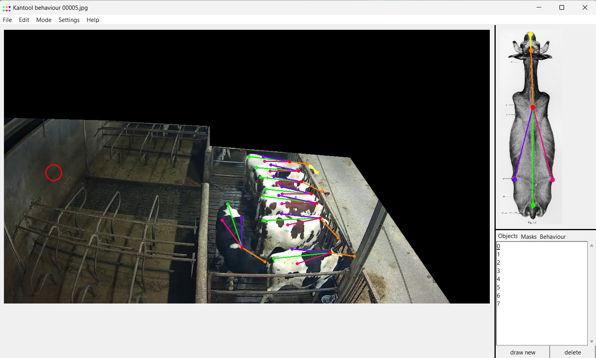

# Kantool_behaviour
Keypoint ANnotation TOOL, expanded for behavioural annotations

The Kantool behaviour application was developed to facilitate keypoint and behaviour annotation. Much focus was placed on generalisability and annotation efficiency, without compromising user-friendliness.

Kantool behaviour generates for each annotated image a single .json file, containing all keypoint coordinates, instances' behaviours and coordinates of annotated masks.

Kantool_behaviour can be run from the Kantool_behaviour.py file, but can also be compiled to an executable file using pyinstaller in combination with the compilation parameters specified in Kantool_behaviour.spec

